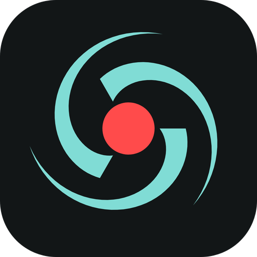

# ScreenLoop

ScreenLoop is a local-first Windows screen recorder built around one idea: keep the screen capture running, then save the last stretch when something worth keeping happens.

It is designed for simple display capture, replay-buffer recording, local clip review, lossless trimming, compacting, and automatic storage cleanup. No account, no cloud workflow, no content platform assumptions.

## What It Does

- **Always-on display capture**: start ScreenLoop once and keep a replay buffer ready in the background.
- **Replay buffer saves**: save the last seconds or minutes from the app or a hotkey.
- **Local clip library**: browse saved replays, favorite important captures, rename files, open their folder, and delete what you no longer need.
- **Protected storage auto-manage**: automatically removes old ScreenLoop-created captures when the selected media limit is reached. Favorited files and files created outside ScreenLoop are never auto-deleted.
- **Clip editor**: trim captures and combine segments without turning the app into a full video suite.
- **Compact exports**: recompress clips when size matters, including CPU AV1 through FFmpeg/libsvtav1 when available.
- **OBS capture engine**: uses OBS under the hood for reliable display and audio capture.

## What It Does Not Do

- No account system.
- No uploads.
- No game detection.
- No game integrations.
- No cloud highlight generation.

ScreenLoop records the screen. That is the product.

## Status

ScreenLoop is in developer preview. Core recording and local clip workflows are being hardened before the first stable release.

## Requirements

- Windows 10 or newer.
- A machine capable of running OBS-based capture.
- FFmpeg for clip operations. The bundled/release build is expected to include the FFmpeg executable used by the app.

## Development

```powershell
dotnet build ScreenLoop.sln
cd Frontend
bun install --frozen-lockfile
bun run build
```

For local debug runs, ScreenLoop starts the Vite frontend in debug mode:

```powershell
dotnet run --project ScreenLoop.csproj -- --debug
```

## Release Build

The GitHub release workflows build the frontend, copy it into `Resources/wwwroot`, publish the Windows app, then package it with `vpk`.

Manual release smoke checks before tagging:

```powershell
cd Frontend
bun run build
cd ..
dotnet build ScreenLoop.sln
dotnet publish -c Release --self-contained -r win-x64 -o publish
```

## License

ScreenLoop is GPLv2 licensed. See [LICENSE.GPL2](LICENSE.GPL2).

## Credits

- [OBS Studio](https://obsproject.com), capture engine.
- [ObsKit.NET](https://github.com/Segergren/ObsKit.NET), C# bindings for OBS.
- [FFmpeg](https://ffmpeg.org), clip processing and compact exports.
